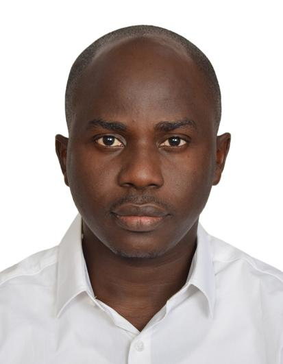

Aside
================================================================================

{width=90%}

Contact Info {#contact}
--------------------------------------------------------------------------------

- <i class="fa fa-envelope"></i> olumideoyalola@gmail.com
- <i class="fa fa-twitter"></i> [iamolumide](https://twitter.com/iamolumide)
- <i class="fa fa-linkedin"></i> [Olumide Michael Oyalola](https://www.linkedin.com/in/olumide-michael-oyalola-9a522857/)
- <i class="fa fa-github"></i> [github.com/Olummy](https://github.com/Olummy)
- <i class="fa fa-phone"></i> +234 803-569-4053
- You can always reach me via email.

Skills {#skills}
--------------------------------------------------------------------------------

- Experienced in statistical analysis, statistical learning models, and business process optimization methods.

- Highly experienced in

  - R,  ODK,  SQL, LaTEX, Excel
  
  
- Tools

  - RStudio,  Jupyter
  
 
- Databases 

  - PostgreSQL,  Elasticsearch
  
  
- BI Tools

  - PowerBI,  Tableau, Kibana
  
- Operating System

  - Windows, Ubuntu, CentOS
  
  

Main
================================================================================

Olumide Oyalola {#title}
--------------------------------------------------------------------------------

### Cover Letter

I am writing to you to express my interest in interviewing for the position of Dashboard/Visualization Developer in R. With my degree in Statistics and Mathematics, and years of experience as a Data Analyst/Business Analytics/Data Scientist under my belt, I think I can be a great asset to your organization.

My professional experience includes data management, data wrangling, crafting algorithms, building bespoke visualizations, and making use of machine learning to mine and make sense of data and then using data visualization to present said data to decision-makers. Couple this experience with my passion for data and I think I’d be an excellent fit at your organization.
The following are my most relevant qualifications and accomplishments:

Crafted algorithms using R to filter data collection results

Implemented data mining strategies to build a database of meaningful data

Developed automated anomaly detector to increase efficiency and accuracy

Created data visualization graphs and charts to make meaning of data for data value chain stakeholders

Developed and followed the standard operating procedure for verifying data integrity

What separates me from other candidates with similar qualifications are my written and verbal communication skills. I love talking about data and thrive on explaining the meaning of data to non-technical stakeholders. If you think I’d be a good fit for your organization, then I’d be thrilled to set up an interview.

<!-- A result-driven data practitioner with an excellent understanding of all aspects of data analytics and statistics. Olumide is experienced in deriving actionable insights from data for supporting business decisions and encouraging factual decision making for the decision-makers. He has since had engagements in various sectors spanning power, manufacturing, banking, and health interventions. Olumide has great communication and people management skills. -->

Professional Experience {data-icon=suitcase}
--------------------------------------------------------------------------------

### Business Transformation Manager

Longbridge Technologies Limited

Lagos, Nigeria

2019

- Work in a cross-functional environment with various business groups, and end-users to identify, document, and communicate business processes.
- Create a system to evaluate the success of any adjustments made within the organization and present findings.
- Communicate strategies and objectives with relevant departments and colleagues.

### Data Scientist

eHealth Systems Africa

Kano, Nigeria

2017 - 2018

- Developed models to discover the patterns and information in vast amounts of spatial and non-spatial data across several programs at eHA to support better programmatic decisions, intervention planning and improved information products.
- Applied data mining techniques, performed statistical analysis, and build high quality prediction models that formed core of eHA's information products on disease surveillance in particular.

### Data Scientist

Venture Garden Group

Lagos, Nigeria

2016 - 2017

- Lead discovery processes with Institute stakeholders to identify the business requirements and the expected outcome.
- Conducted advanced data analysis and complex designs algorithm.
- Applied advanced statistical and predictive modeling techniques to build, maintain, and improve on multiple real-time decision systems.
- Validates analysis using scenario modeling.

### Quality Assurance Analyst

Computer Warehouse Group, Plc

Lagos, Nigeria

2013 - 2016

- Encouraged factual approach to decision making by providing the management an accurate analysis of people and processes.
- Achieved success in providing standard value-added metrics for business model.
- Continual implementation and auditing of ISO 9001:2008.
- Quality process analysis to achieving a system thinking organization.
- Quality spot checks of project implementations & Services (Software, Hardware, Communication).
- Provided both administrative and analytic support to departments in order to manage critical and people sensitive projects.
- Collaborated with the VP of Sales in the development of sales forecasts and projections.
- Summarize and report performance against sales quotas to all sales personnel in a timely manner.
- Proactively prepare and deliver ad hoc customer analysis to sales team members and senior management.

### Data Analyst

Practical Sampling International

Lagos, Nigeria

2012 - 2013

- Supervised the data collection process of many high profile projects.
- Processed and analyzed raw data collected from field work.
- Improved the statistical procedure usage and reporting method.

Teaching Experience {data-icon=chalkboard-teacher}
--------------------------------------------------------------------------------

### Data Analytics Using R.

Data Analytics facilitator at BNet Learning

Lagos, Nigeria

2018

### Guest Faculty Business Analytics.

Business Analytics facilitator at EduPristine

Lagos, Nigeria

2015 - 2016

### Guest Faculty IBM SPSS.

Instructor of IBM SPSS and Data Analysis Training Courses at AfriHUB Nigeria Limited Inc.

Abia, Nigeria

2011 - 2012

Recent Projects {data-icon=laptop}
--------------------------------------------------------------------------------

### Data Scientist

eHealth Systems Africa

Kano, Nigeria

2017 - 2018

Data Portal [CKAN](https://ckan.org/)

- **Client**: National Polio Emergency Operation Center 
- **Aim**: The project was centered on achieving data democratization with appropriate data governance structure among the partners.

 **Role**
 
- Worked with different stakeholders to identify the types of data currently captured.
- Identified the structural gap among related data set (resource file).
- Obtain the ideal structure from the stakeholders, clean and validate each resource against the communicated structure.
- Built visualizations, dashboards using the agreed metrics for each of the data set captured by the stakeholders.
- Trained the team client on how to use the platform before the project handover.

FMoH Dashboard

- **Client**: Federal Ministry of Health 
- **Aim**: This is an analytics dashboard built using majorly Elasticsearch, Logstash, & Kibana (ELK) to describe the state of the health facilities across the country.

 **Role**
 
- Pipelined data from the geodatabase to the elasticsearch using logstash.
- Created visualizations using kibana based on the agreed metrics/indicators.

Education {data-icon=graduation-cap data-concise=true}
--------------------------------------------------------------------------------

### University of Ibadan

M.S. in Statistics

Oyo State, Nigeria

2015

### Federal University of Technology, Akure

B.Tech. in Industrial Mathematics

Ondo State, Nigeria

2010

----------------------------------------------------

